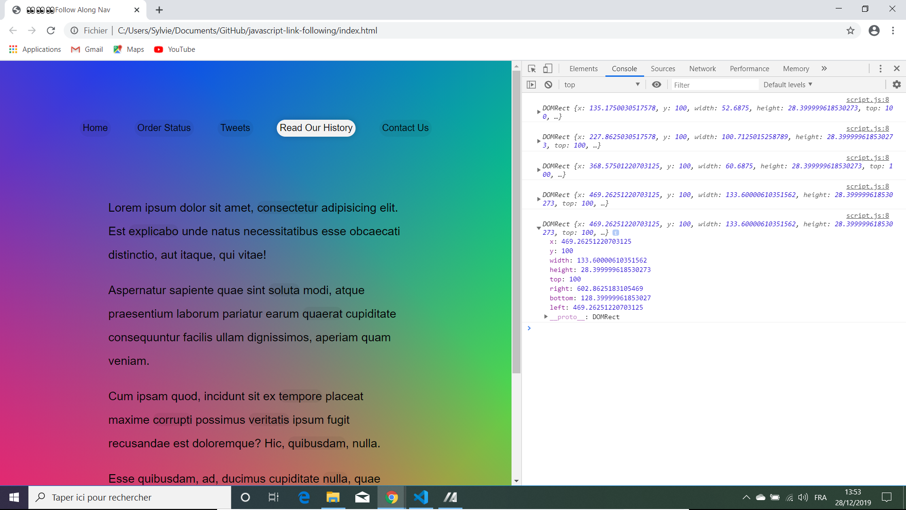

# Javascript Link Following

Wes Bos Youtube Tutorial: [JavaScript Exercise: Follow Along Links - #JavaScript30 22/30](https://www.youtube.com/watch?v=POP_qri7RA8&list=PLu8EoSxDXHP6CGK4YVJhL_VWetA865GOH&index=22).


*** Note: to open web links in a new window use: _ctrl+click on link_**

## Table of contents

* [General info](#general-info)
* [Screenshots](#screenshots)
* [Technologies](#technologies)
* [Setup](#setup)
* [Features](#features)
* [Status](#status)
* [Inspiration](#inspiration)
* [Contact](#contact)

## General info

* Tutorial Code to highlight anchor tags as they are scrolled over.

## Screenshots

.

## Technologies

* [Javascript v1.9 ECMA-262 ECMAScript 2018](http://www.ecma-international.org/publications/standards/Ecma-262.htm)

## Setup

* Open index.html in browser. If any code is changed the browser needs to be refreshed.

## Code Examples

*  determine position and dimensions of highlighting box. 

```javascript
highlightLink = () => {
  const linkCoords = this.getBoundingClientRect();
  console.log(linkCoords);
  const coords = {
    width: linkCoords.width,
    height: linkCoords.height,
    top: linkCoords.top + window.scrollY,
    left: linkCoords.left + window.scrollX
  };
  
  highlight.style.width = `${coords.width}px`;
  highlight.style.height = `${coords.height}px`;
  highlight.style.transform = `translate(${coords.left}px, ${coords.top}px)`;
};
```

## Features

*  Includes scroll position in the equation so hightlighting is in the correct position even after scrolling.

## Status & To-Do List

* Status: Working.

* To-Do: Could add additional highlighting of 'p's for example in a different colour.

## Inspiration

* Wes Bos Youtube Tutorial: [JavaScript Exercise: Follow Along Links - #JavaScript30 22/30](https://www.youtube.com/watch?v=POP_qri7RA8&list=PLu8EoSxDXHP6CGK4YVJhL_VWetA865GOH&index=22)

## Contact

Repo created by [ABateman](https://www.andrewbateman.org) - feel free to contact me!
